# project - shitpaper
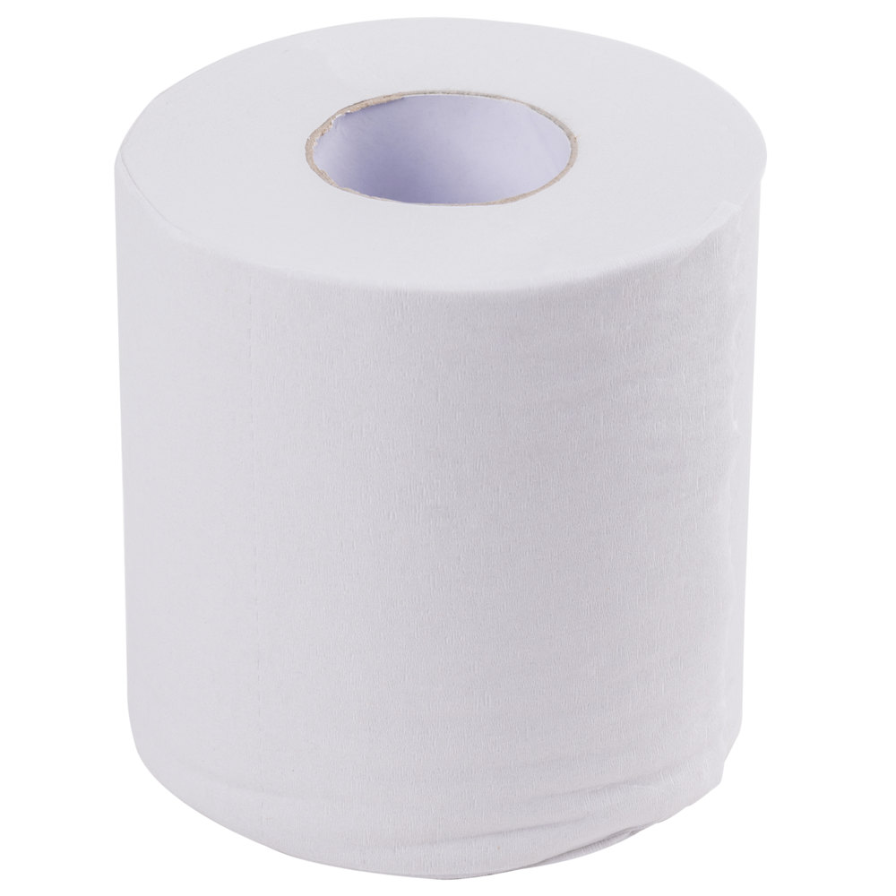</img>

## complicating the simplest thing ever

---

# out of shitpaper
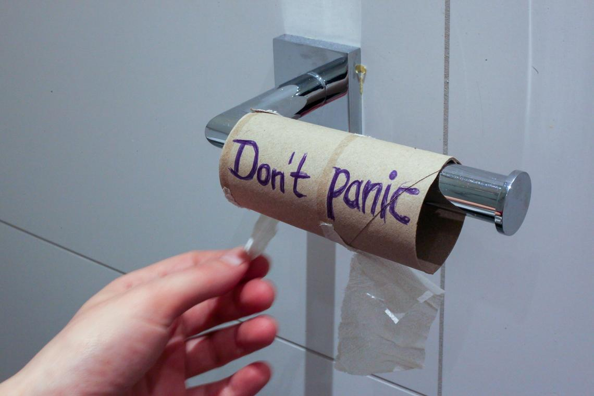</img>

---

# too mutch shitpaper
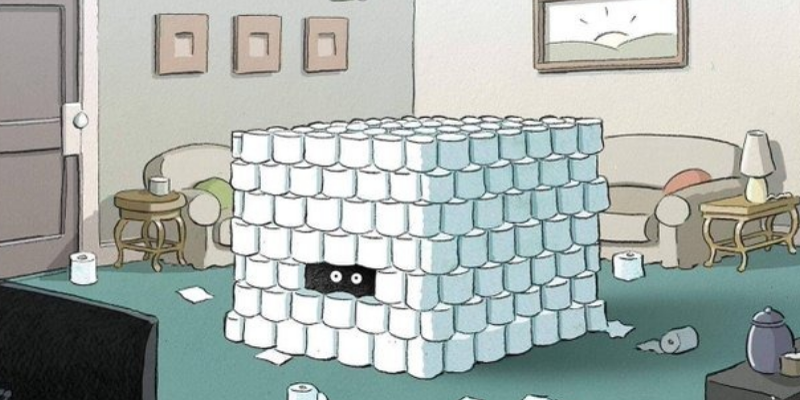</img>

---

## and thats how ...
.
# I got promoted
.
## ... to a shit paper manager!

---

# now its my problem ...
</img>

__storage - monitoring - resupply__

---

# shitpaper storage

### turi tilpti pakankamai daug
### turi but vienoj vietoj
### turi uzimti mazai vietos
### turi matytis kai baiginejasi

---

# the pipe
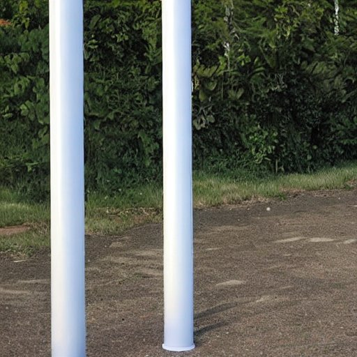</img>

---

# shitpaper scale
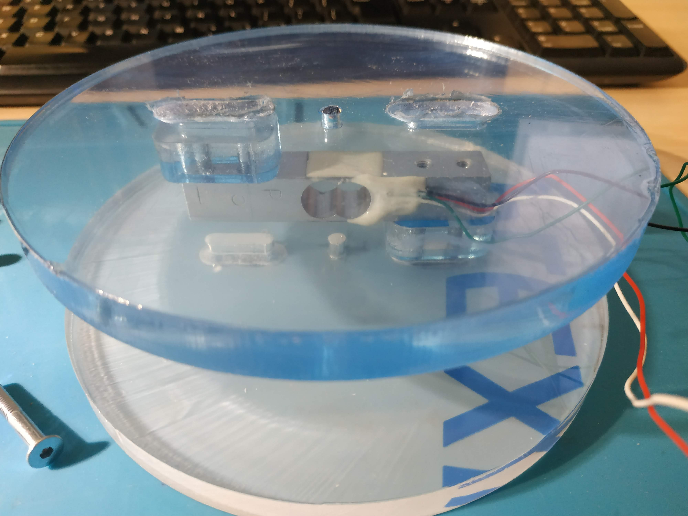</img>

### kaip zinoti kiek turim sikpopieros - galima pasverti
### sverimas lengvas nes sikpopiera laikosi vertikaliai

---

# scale components
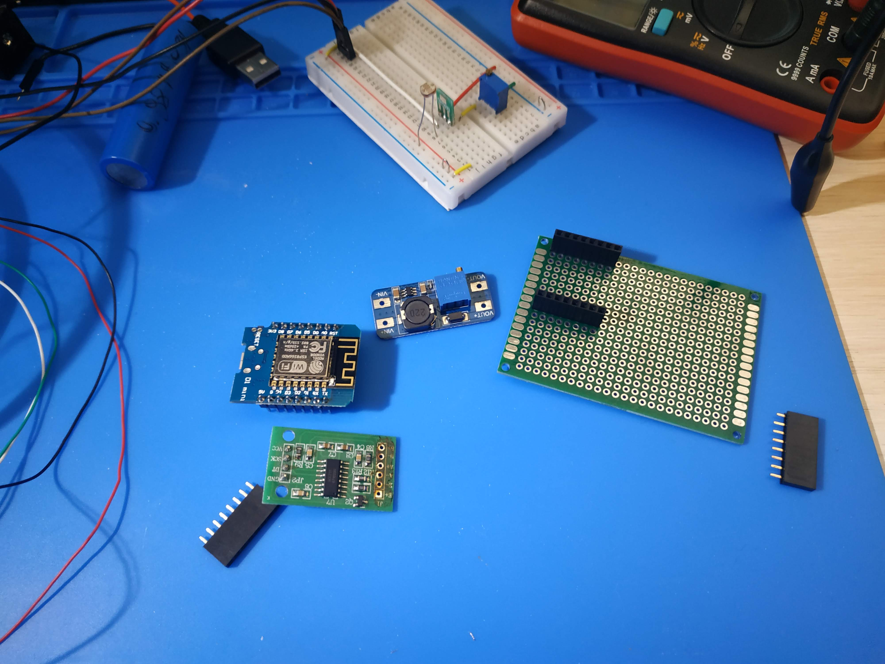</img>

* load cell
* adc
* battery
* timer

---

# schematics
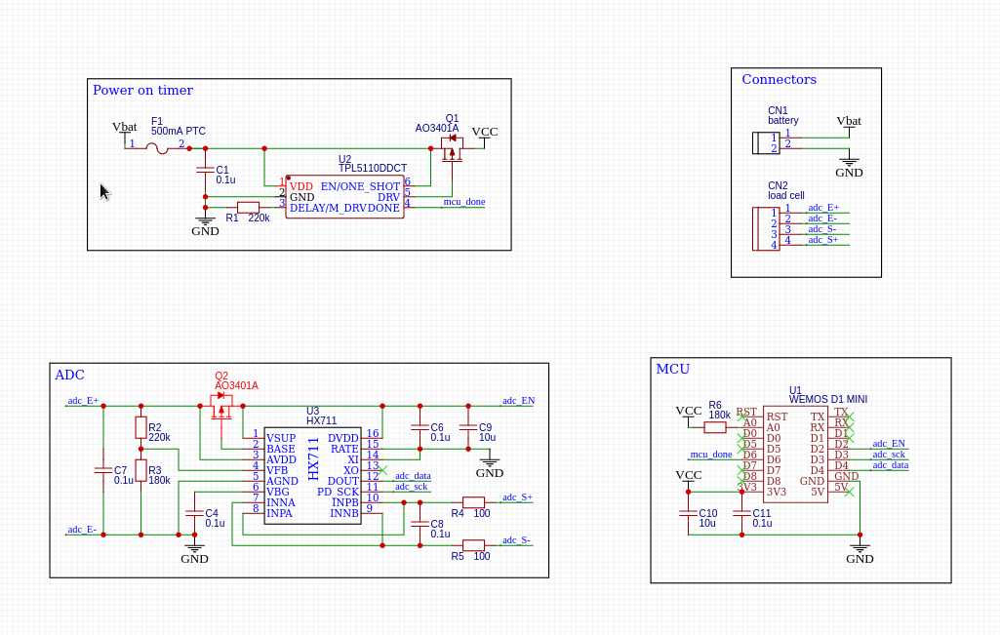</img>

---

# image: battery or scale alone

### ner laidu, turi veikt nuo baterijos
### nenoriu keist baterijos daznai
### matavimas trunka apie 6 sec, naudoja sakykim 200mA komunikacijai
### noreciau matuoti kokia 10 kartu per para

---

# esp sleep modes
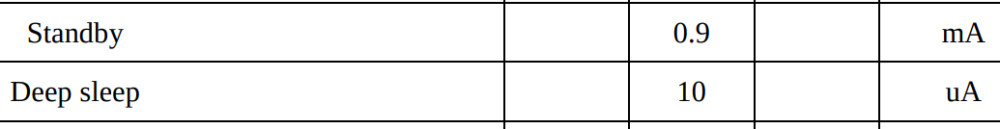</img>

### deep sleep mikro amperu eiles

---

# tpl5110 datasheet header with sleep current
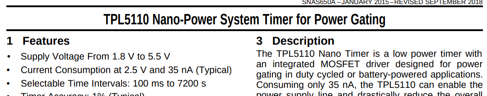</img>

### galima miegoti ir 1000 kartu efektyviau
### elektra komunikacijai apie 1.0~1.5 Ah per metus
### elektra miegui apie 0.001 Ah per metus
### teorinis vienos ikrovos laikas apie 2 metu

---

# grafana first day flat line
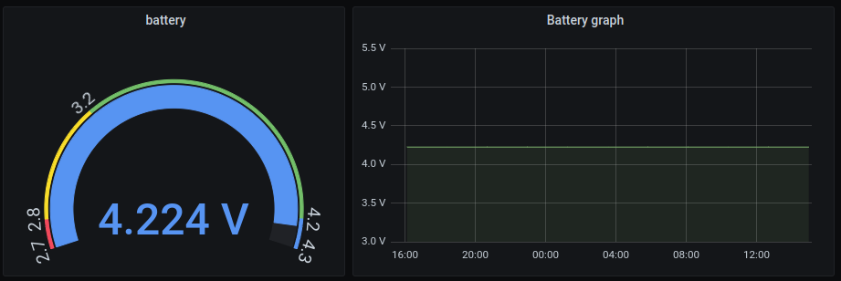</img>

### linija plokscia, ar tikrai veikia?

---

# grafana first 2 weeks
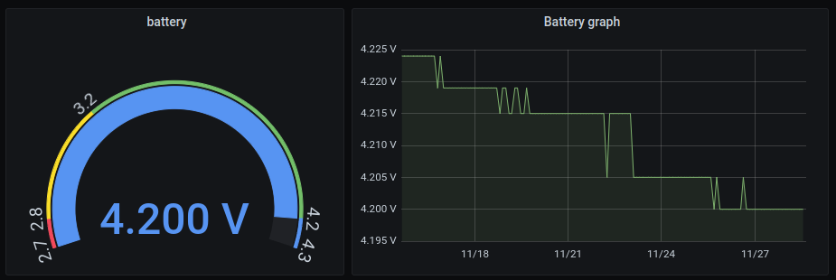</img>

### gal ir veikia, baterijos itampa pamazejo
### ADC rezoliucija 4-5 mV

---

# grafana 1 year
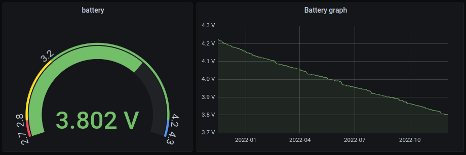</img>

### prabego metai, baterija nusedo iki 3.8V
### isvada kad low energy veikia :smile:

---

# grafana shitpaper dial
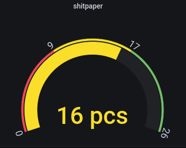</img>

### kada uzsakyt 8
### kada uzsakyt 16

---

# grafana shitpaper graph year
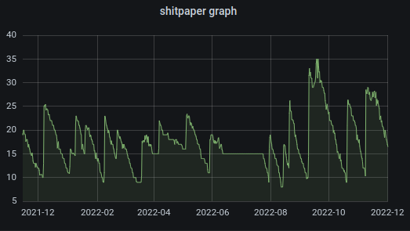</img>

### matosi uzsakymai ir sunaudojimas
### svyravimas galimai del dregmes pasikeitimu bet funkcijai netrukdo

---

# shitpaper count, beer count code
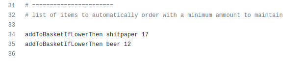</img>

### cron patikrint ar jau laikas isidet i krepseli

---

# barbora api calls
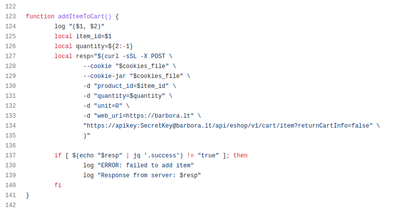</img>

### barboros idejimas i krepseli

---

# barbora product group
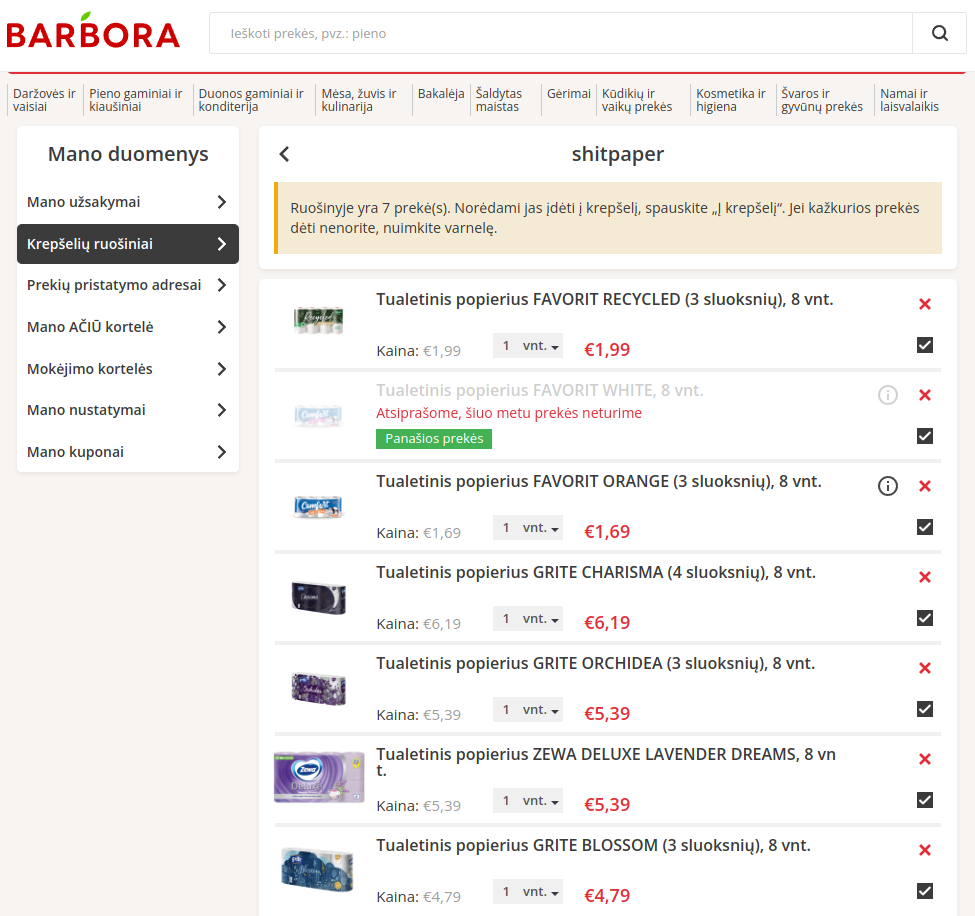</img>

### barboros pasirinkimas kokios sikpopieros tinkamos

---

# barbora cart
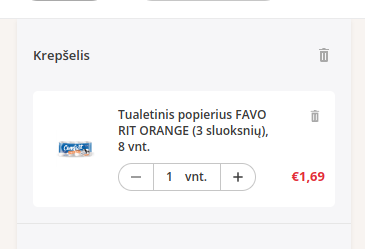</img>

## me(human) no longer need to apply

---

# links to source

### easyeda schematics
  * https://oshwlab.com/dariuskt/wifi-scale
### github code for scale
  * https://github.com/dariuskt/wifi-scale
### github code for order
  * https://github.com/dariuskt/ordering-automation
